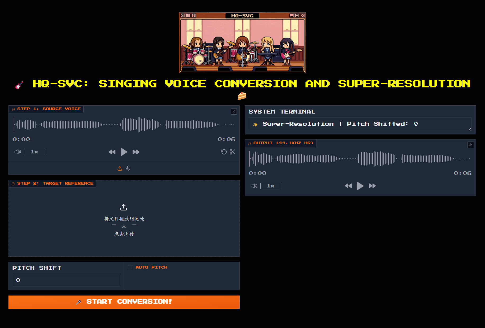
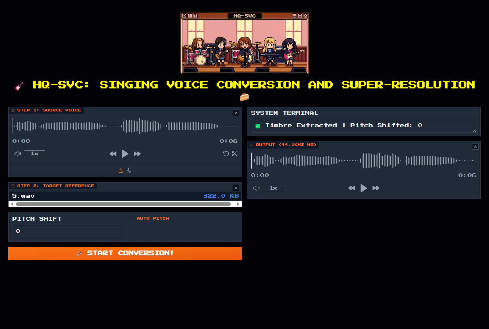

# HQ-SVC: Towards High-Quality Zero-Shot Singing Voice Conversion in Low-Resource Scenarios
Official Repository of Paper: "Towards High-Quality Zero-Shot Singing Voice Conversion in Low-Resource Scenarios"(AAAI 2026)
<div align="center">
    <p>
    
    </p>
    <a href="https://arxiv.org/abs/2511.08496"></a>
    <a href="https://shawnpi233.github.io/HQ-SVC-demo"></a>
    <a href="https://huggingface.co/shawnpi/HQ-SVC"></a>
</div>

## 🗞 News

- **[2025-11-08]** 🎉 Paper accepted by AAAI 2026
- **[2025-11-12]** 🎉 arXiv paper released
- **[2025-11-12]** 🎉 Demo released
- **[2025-12-24]** 🎉 Inference codes and pre-trained models released

## 📅 Release Plan
- [x] arXiv preprint
- [x] Online demo
- [x] Inference codes
- [x] Pre-trained models
- [ ] Training codes

## ✨ New features
- [ ] Singing Style control
- [ ] Improved Quality

HQ-SVC is an efficient framework for high-quality zero-shot singing voice conversion (SVC) in low-resource scenarios. It achieves disentanglement of content and speaker features via a unified decoupled codec, and enhances synthesis quality through multi-feature fusion and progressive optimization.

Unlike existing methods that demand large datasets or heavy computational resources, **HQ-SVC** unifies:
- 🚀 Zero-shot conversion for unseen speakers without fine-tuning
- ⚡ Low-resource training (single consumer-grade GPU, <80h data)
- 🎧 Dual capabilities: high-quality singing voice conversion + voice super-resolution
- 🎯 Superior naturalness and speaker similarity compared to SOTA methods

## 🎸 Try Inference
### 1. Download Environment 下载环境
```bash
wget -c https://huggingface.co/shawnpi/HQ-SVC/resolve/main/environment.tar.gz
```
```bash
wget -c https://hf-mirror.com/shawnpi/HQ-SVC/resolve/main/environment.tar.gz # 可选镜像源
```

### 2. Unzip Environment 解压环境
```bash
mkdir -p venv
tar -xzf environment.tar.gz -C venv
```

### 3. Activate Environment 激活环境
```bash
source venv/bin/activate
```

### 4. Download Pretrained Models 激活环境
```bash
export HF_HUB_ENABLE_HF_TRANSFER=0 
huggingface-cli download shawnpi/HQ-SVC --include "utils/pretrain/*" --local-dir . --max-workers 1
```

### 5.Running 运行
```bash
python gradio_app.py
```

<div align="center">


**Zero-shot Super-Resolution (16 kHz to 44.1 kHz)**: Input only `source` audio
</div>


<div align="center">



**Zero-shot Singing Voice Conversion**: Input both `source` audio and `target` audio
</div>

## 📜 Citation

If you use HQ-SVC in your research, please cite our work:

```bibtex
@article{bai2025hq,
  title={HQ-SVC: Towards High-Quality Zero-Shot Singing Voice Conversion in Low-Resource Scenarios},
  author={Bai, Bingsong and Geng, Yizhong and Wang, Fengping and Wang, Cong and Guo, Puyuan and Gao, Yingming and Li, Ya},
  journal={arXiv preprint arXiv:2511.08496},
  year={2025}
}
```

## Star History
[](https://www.star-history.com/#ShawnPi233/HQ-SVC&type=date&legend=top-left)
